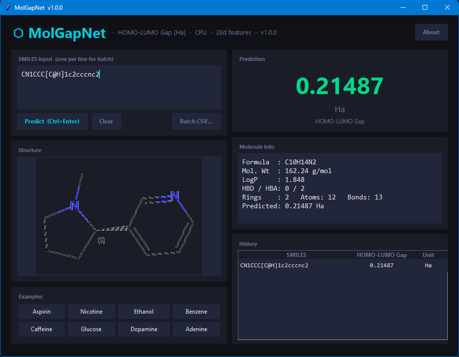
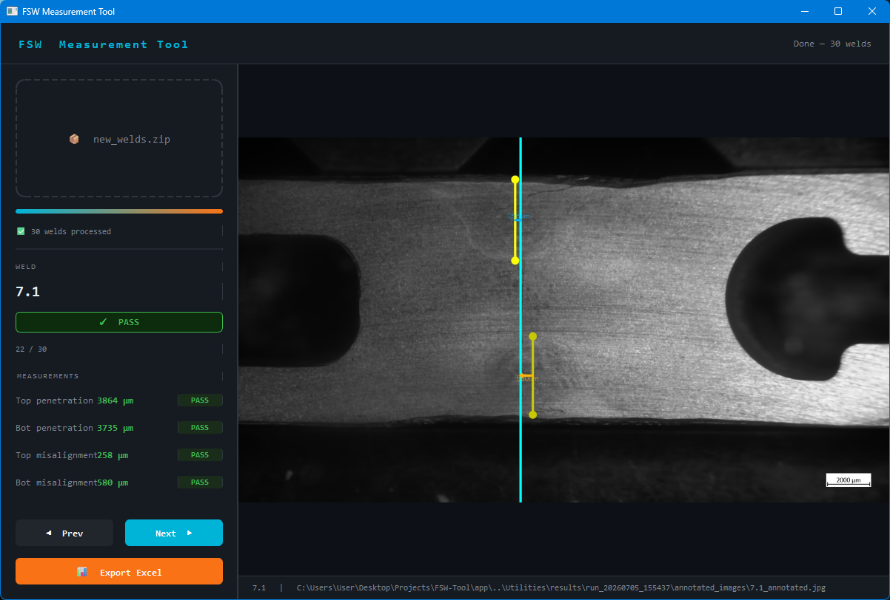
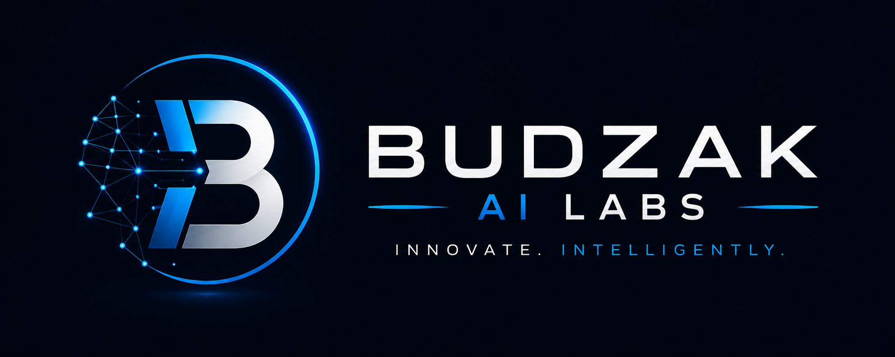

  

  

## :microphone: About Me

  <i>Science → Data → Models → Software</i>

I'm a Chemistry graduate with a growing obsession for turning scientific problems into software.

My path started in chemistry and laboratory work, where I learned to think in terms of measurements, data, systems, and why things behave the way they do. Somewhere along the way, I started asking a different question:

"Could I make a computer do this?"

That question pulled me into Python, machine learning, deep learning, and scientific computing.

These days, I enjoy building things at the intersection of science and AI — from molecular property prediction with graph neural networks to computer-vision tools for industrial inspection.

I'm still learning a lot, but that's kind of the point. Build something → break it → figure out why → make it better.

That's what I enjoy doing.

## 🌱 What I'm Building

<table>
  <tr>
    <td width="50%" valign="top">
      <h3>🔬 Molecular Machine Learning</h3>
      
        
      <b>Graph Neural Network for molecular property prediction</b>
      
Predicting molecular properties from molecular structures using graph-based representations and the QM9 dataset.

      <b>Python · PyTorch · GNN · Molecular ML</b>
    </td>
    <td width="50%" valign="top">
      <h3>👁️ AI-Assisted Industrial Inspection</h3>
      
          
      <b>Computer Vision for Friction Stir Welding</b>
      
AI-assisted inspection software for extracting geometric measurements from industrial welding images.

      <b>Python · PyTorch · ResNet · Computer Vision</b>
    </td>
  </tr>
</table>

# 🧪 Budzak AI Labs

### Science × AI × Software

*A personal lab for experiments, projects, and ideas at the intersection
of science, machine learning, and software engineering.*

**Build → Experiment → Measure → Improve**

## 🪐 Beyond the Code

💬 &nbsp;Ask me about: **Python, ML experiments, scientific computing, or the projects I'm currently breaking.**

⚡ &nbsp;Fun fact: **My favorite projects usually start with "I wonder if I can automate this."**

## 🛠️ Tech Stack

### Languages

  

### Machine Learning

  

### Scientific Computing & Data

   

### Tools & Infrastructure

   

## 📚 Currently Learning

I'm going deeper into modern AI — from neural network architectures
to building LLM-powered systems that can retrieve information,
use tools, and operate through structured workflows.

### 🧠 Deep Learning

GNNs · Transformers · Attention · RNNs · LSTMs · GRUs

### 💬 NLP & LLMs

NLP · Embeddings · Semantic Search · RAG · Hugging Face

### 🔗 LLM Applications

LangChain · LangGraph · Tool Calling · Structured Outputs

### 🤖 Agentic AI

AI Agents · Memory · Planning · Tool Use · Agent Orchestration
## 📊 GitHub Stats

  
  

## 📈 Contribution Graph

  

## 🔗 Connect With Me

  
  
  

